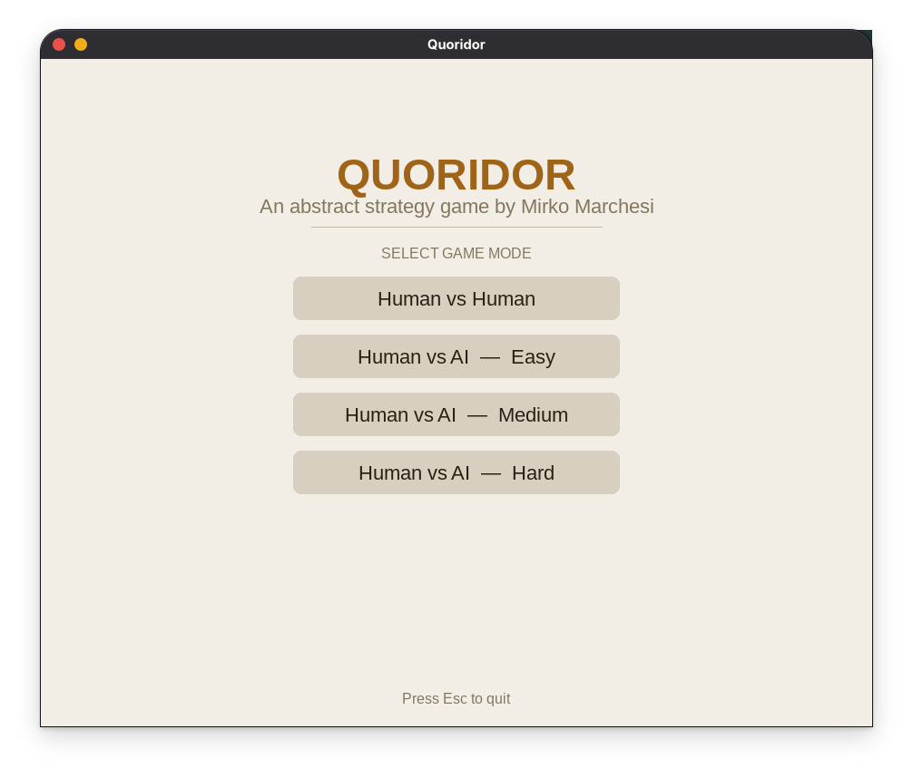
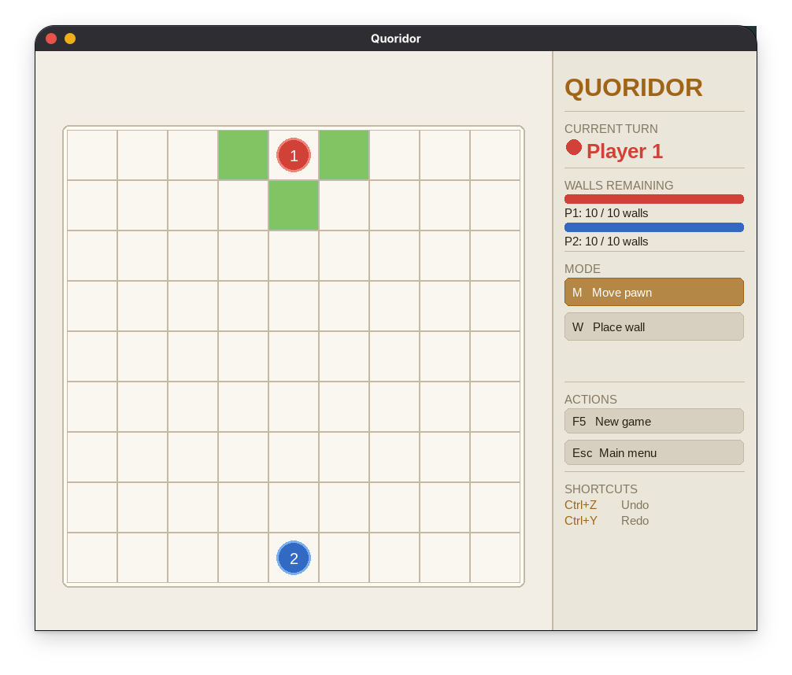
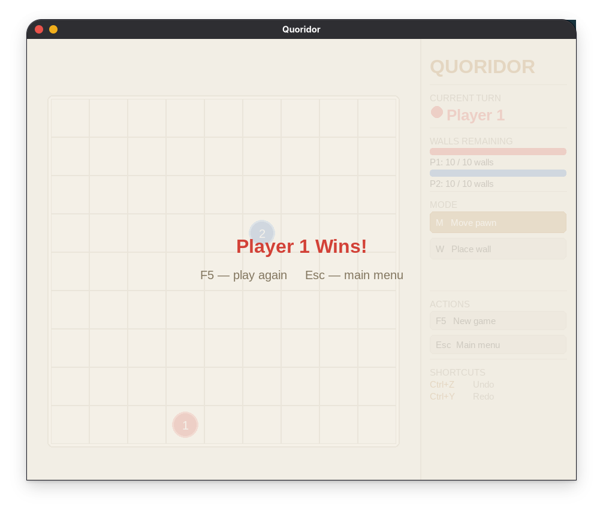

# 🏆 Quoridor — Python Pygame Implementation

> A complete implementation of the award-winning abstract strategy board game **Quoridor**, built with Python and Pygame. Features a fully playable GUI with a warm light theme, intelligent AI opponents at three difficulty levels, clickable sidebar controls, and undo/redo functionality.

---

## 📸 Screenshots

| Menu Screen | Gameplay | Win Screen |
|-------------|----------|------------|
|  |  |  |

---

## 🎮 Game Description

Quoridor is a strategy board game invented by **Mirko Marchesi** in 1997, winner of the **Mensa Mind Game award**. Two players compete on a 9×9 grid, each trying to move their pawn to the opposite side before their opponent does. On each turn, a player must either:

- **Move** their pawn one square orthogonally
- **Place a wall** to block the opponent's path

Walls cannot completely trap a player — there must always be at least one valid path to the goal. This creates deep strategic tension between racing forward and blocking your opponent.

---

## ✨ Features

- ✅ Complete Quoridor ruleset for 2 players
- ✅ Human vs Human local multiplayer
- ✅ Human vs AI with 3 difficulty levels
- ✅ Valid move highlighting (green cells shown on your turn)
- ✅ Wall slot indicators — dashed lines show all placeable positions
- ✅ Wall placement preview on hover (coloured ghost wall)
- ✅ Clickable sidebar buttons for all actions (no keyboard required)
- ✅ Undo / Redo (unlimited, Ctrl+Z / Ctrl+Y)
- ✅ Turn indicator and wall count display with progress bars
- ✅ Win screen with game over overlay
- ✅ Game reset and return to menu (keyboard and button)
- ✅ Warm light-themed GUI (cream, wood tones)

---

## 🤖 AI Difficulty Levels

| Level | Algorithm | Description |
|-------|-----------|-------------|
| **Easy** | Greedy | Moves toward goal each turn, places random walls occasionally |
| **Medium** | BFS Heuristic | Uses pathfinding to pick the best move, places walls to slow opponent |
| **Hard** | Minimax + Alpha-Beta Pruning | Thinks 4 moves ahead, evaluates all possible outcomes, plays optimally |

---

## 🗂️ Project Structure

```
Quoridor_Game/
│
├── main.py
├── config.py
├── README.md
├── .gitignore
│
├── assets/
│   ├── screenshot_menu.png
    ├── screenshot_game.png
│   └── screenshot_win.png
│
├── game/
│   ├── __init__.py
│   ├── board.py
│   ├── player.py
│   ├── rules.py
│   └── game_state.py
│
├── ai/
│   ├── __init__.py
│   ├── easy_lvl.py
│   ├── medium_lvl.py
│   └── hard_lvl.py
│
├── gui/
│   ├── __init__.py
│   ├── renderer.py
│   └── input_handler.py
│
└── utils/
    ├── __init__.py
    ├── pathfinding.py
    └── history.py
```

---

## 🔧 Installation

### Requirements
- Python 3.8 or higher
- Pygame 2.0 or higher

### Step 1 — Clone the repository
```bash
git clone https://github.com/youssefhatembahig6-alt/Quoridor_Game
cd quoridor
```

### Step 2 — Install dependencies
```bash
pip install pygame
```

### Step 3 — Run the game
```bash
python main.py
```

---

## 🕹️ Controls

All actions are available as **clickable sidebar buttons** or keyboard shortcuts.

| Input | Action |
|-------|--------|
| `Left Click` on green cell | Move pawn |
| `W` button / `W` key | Switch to Wall placement mode |
| `Left Click` on wall slot | Place wall (must be in Wall mode) |
| `R` button / `R` key | Rotate wall orientation (H ↔ V) |
| `M` button / `M` key | Switch back to Move mode |
| `Ctrl + Z` | Undo last move |
| `Ctrl + Y` | Redo last move |
| `F5` button / `F5` key | Reset / New game |
| `Esc` button / `Escape` key | Return to main menu |

> **Tip:** Green cells show valid pawn moves. In Wall mode, dashed lines appear on the board showing every slot where a wall can legally be placed. Hover over a slot to preview the wall before clicking.

---

## 📐 How to Play

1. **Launch the game** and select a mode from the menu
2. **Player 1 (Red)** starts at the top center — goal is the bottom row
3. **Player 2 (Blue)** starts at the bottom center — goal is the top row
4. Each turn — either **move your pawn** or **place a wall**
5. Pawns move one square orthogonally (up, down, left, right)
6. If your pawn is adjacent to the opponent, you can **jump over** them
7. If a jump is blocked by a wall, you can move **diagonally** around them
8. Walls are **2 squares long** and block movement between cells
9. A wall **cannot** be placed if it completely blocks any player's path
10. First player to reach the opposite side **wins**

---

## 🧠 Technical Details

### Architecture

The project follows a clean separation of concerns:

- **`Game`** — passive data container (board, players, turn, winner). Never contains logic.
- **`Rules`** — all move validation and game state transitions. Calls `History` before each move.
- **`Renderer`** — pure drawing. After each `draw_frame()` call it populates `sidebar_rects`, a dict of clickable button rectangles that `InputHandler` reads.
- **`InputHandler`** — translates raw pygame events into `Rules` calls. Checks sidebar buttons on every click before checking the board, so UI controls are always responsive.

### Pathfinding

Wall legality is enforced using **Breadth-First Search (BFS)**. After every attempted wall placement, BFS checks that both players still have at least one valid path to their goal row. If either player is blocked, the wall is rejected.

`bfs_distance` and `bfs_next_step` power the AI evaluation function and the Easy/Medium AI movement respectively.

### Undo / Redo

Every move (pawn or wall) pushes a full **`GameState` snapshot** onto an undo stack before applying the move. The snapshot deep-copies both players and the board so future mutations never corrupt saved states. Undoing pops the snapshot and restores the game; redoing re-applies it. The redo stack clears whenever a new move is made.

### Minimax AI

The Hard AI uses **Minimax with Alpha-Beta Pruning** at depth 4. The evaluation function is:

```
score = opponent_distance_to_goal − my_distance_to_goal
      + (my_walls_left − opponent_walls_left) × 0.5
```

A higher score means the AI is closer to winning relative to the opponent. Alpha-beta pruning cuts branches that cannot affect the final decision, keeping search fast enough for real-time play.


---

## 🎥 Demo Video

▶️ [Watch the demo video here](https://drive.google.com/drive/folders/1OwhzvfvSyQ4B7L3vz9xh-sL7ZUFBeFbu)

The video covers:
- Game setup and UI overview
- Human vs Human gameplay
- Human vs Easy, Medium, and Hard AI
- Wall placement demonstration
- Undo/Redo demonstration

---

## 📚 References

- [Official Quoridor Rules](https://en.gigamic.com/files/media/fiche_pedagogique/educative-sheet_quoridor_en.pdf)
- [Quoridor on BoardGameGeek](https://boardgamegeek.com/boardgame/624/quoridor)
- [Minimax Algorithm — Wikipedia](https://en.wikipedia.org/wiki/Minimax)
- [Alpha-Beta Pruning — Wikipedia](https://en.wikipedia.org/wiki/Alpha%E2%80%93beta_pruning)
- [BFS Pathfinding — Wikipedia](https://en.wikipedia.org/wiki/Breadth-first_search)
- [Pygame Documentation](https://www.pygame.org/docs/)

---

## 📄 License

This project was developed as an academic assignment. All game logic and implementation are original work by the team.